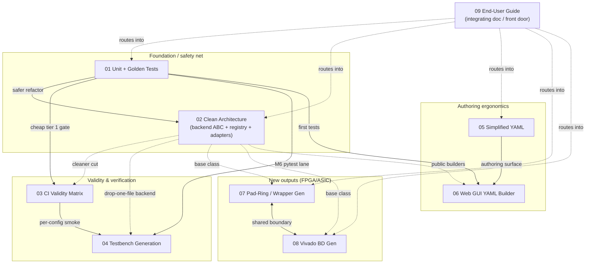

# 00 — nanosoc_gen Improvement Roadmap: Index & Overview

This roadmap is a set of **nine independently-implementable design documents** that improve the
`nanosoc_gen` SoC generator (the Python tool under `nanosoc_arch_tech/nanosoc_gen/soc_model/` that
turns `sys_desc/*.yaml` into RTL, address maps, linker scripts, firmware headers, discovery tables,
and docs). Each doc is a standalone implementation spec — grounded in the current code, with a
status/scope section, a milestone-based implementation plan (S/M/L effort), and explicit
dependencies — written so one engineer can pick it up months from now and implement it without the
others.

**How to use this roadmap:** read this overview first to see the dependency structure, then **pick
one doc at a time**. Start with the [recommended sequencing](#4-recommended-sequencing) below, or
jump to one of the alternative entry points if your priority is test safety, author ergonomics, or
shipping a new output format. Every doc's `Status & scope` section states precisely what is in and
out of scope so the docs don't overlap.

---

## 1. The nine docs at a glance

| # | Title | One-line goal | Effort | Greenfield / Extends | Key dependencies |
|---|---|---|---|---|---|
| [01](01-unit-testing-nanosoc-gen.md) | Unit + Golden/Snapshot Test Suite | Build a `pytest` suite (unit + golden-snapshot) for the generator — the safety net there is none of today | **M** | Greenfield (new `nanosoc_gen/tests/`) | None — the foundation |
| [02](02-clean-architecture-adapters-backends.md) | Clean Architecture for Adapters & Backends | A `Backend` base class + registry + a data-driven Protocol/adapter layer, replacing the hand-wired import block and duplicated bus tables | **L** (M for first cut) | Extends (refactor of `__main__.py`, backends, `protocol_utils.py`) | None hard; far safer after **01** |
| [03](03-ci-system-validity-matrix.md) | CI System-Validity Matrix | Fix `--config-override` so it reaches the model, then sweep a parameter matrix in CI at the cheapest valid tier | **M** (L full) | Extends (generator fix + new `ci/matrix.py` + GitLab stage) | **01** (shares tier fns); stronger after **02** |
| [04](04-testbench-generation-default-tests.md) | Testbench Generation + Default Tests | A `SoCTbBackend` that emits a `tb_top.sv` + cocotb env + model-derived default tests (boot, reg, mem, IRQ) | **M–L** | Greenfield backend | **01** (for M6 pytest); optional **02**; complements **03** |
| [05](05-simplified-yaml-format.md) | Simplified, Readable YAML Format | A sugar/`expand` layer (presets, auto-addresses, terse buses) between parser and builder — no model/backend changes | **M** | Extends (new `expand.py` pre-pass) | Composes with **02**; goldens from **01** keep it honest |
| [06](06-web-gui-yaml-builder.md) | Web-app GUI YAML Builder | A FastAPI/Alpine panel to author `sys_desc` YAML with live validation, reusing the existing validator + `html.py` canvas | **M** (MVP), **L** (full) | Extends (new `gui_service.py` + demo_gui panel) | **05** (authoring surface); benefits from **02**; first tests ride **01** |
| [07](07-toplevel-wrapper-generation-fpga-asic.md) | Top-Level Wrapper Generation (FPGA & ASIC) | A `SoCPadRingBackend` driven by per-tech pad descriptors + pin maps, replacing hand-written tech pad files (+UPF/`.io`) | **M** | Extends (new backend; the dead generic template) | Optional **02** base class; sibling of **08** |
| [08](08-vivado-block-diagram-generation.md) | Vivado Block-Diagram Generation | A `SoCVivadoBdBackend` emitting packaged-IP TCL with typed (IP-XACT) interconnect ports + optional block-design TCL | **M–L** | Greenfield backend (+ wrapper variant) | Optional **02**; coordinates boundary with **07** |
| [09](09-user-guide.md) | Intuitive End-User Guide | The front-door user guide for the whole flow + an auto-generated field/artifact reference backend | **M–L** | Extends (prose + new `schema_doc.py` backend) | Routes into all of **01–08**; **05** for §4a, **03** for CI gate |

Effort key: **S** ≈ hours–1 day, **M** ≈ a few days–~1 week, **L** ≈ multi-week / multi-PR.

---

## 2. Dependency graph



Solid arrows = real (recommended-before) dependency; dotted = "benefits from / cleaner if available"
(not a hard blocker). ASCII summary of the same structure:

```
                 01 Unit/Golden Tests  ── (safety net under everything)
                  │        │      │   │
        (safer)   ▼        ▼      ▼   ▼
   ┌──────── 02 Clean Arch  03 CI    04 TB-gen   06 Web GUI
   │           │   │   │      │         ▲           ▲
   │  (base)   │   │   └──────┘         │           │
   │           ▼   ▼        (smoke per-config)      │
   │       07 Pads  08 Vivado-BD                    │
   │           └────┬────┘                          │
   │          (shared boundary)                     │
   │                                                │
   └─ 05 Simplified YAML ───────────────────────────┘  (authoring surface for 06)

   09 User Guide  ── integrating front door; cross-links 01–08, consumes 05 + 03's CI conventions
```

**Reading the edges (each verified against the docs' own `Dependencies & sequencing` sections):**
- **01 underpins almost everything.** It is the only doc with no prerequisite; 02/03/04/06 each name
  it as the thing their tests/goldens hang off.
- **02 is the soft enabler.** 04, 07, 08 each become "drop one `@register_backend` file" once 02's
  registry exists, and 03 gets a cleaner topology knob — but none of them *block* on 02.
- **05 underpins 06.** The GUI is the natural authoring surface for the simplified format; 06
  consumes 05's `expand`/JSON-schema work for its "expand to canonical" export and auto-pack.
- **07 and 08 are siblings.** Both turn the chip/wrapper boundary into data; they must agree on the
  `Interface`→boundary mapping (07's M4 port/IP-XACT lock is the contract 08 consumes).
- **09 integrates.** It does not unblock features; it unblocks *adoption* by routing newcomers into
  01–08 and consuming 05 (preferred format) and 03 (CI doc-staleness gate).

---

## 3. Recommended sequencing

The default path optimises for **building a safety net before any refactor, then ergonomics, then
new outputs**:

1. **01 — Unit + Golden tests (first, always).** No prerequisites; de-risks every later change. The
   golden snapshots turn "did this refactor change the generated SV/flist/linker?" into a reviewable
   diff. Land M1–M3 (harness + validator/parser/builder units) before touching anything else.
2. **02 — Clean architecture (with 01's goldens guarding it).** The backend ABC + registry + adapter
   layer is the single highest-leverage refactor: it makes 04/07/08 one-file features and gives 03 a
   real topology knob. Every milestone is byte-identical-output by design, which is exactly what 01's
   goldens verify. Stop after M1–M4 (registry + adapter source-of-truth, ~M) if budget is tight; the
   `toplevel.py` surgery in M5/M6 is the L cost.
3. **05 — Simplified YAML.** With goldens in place, the desugar pre-pass can be proven not to change
   canonical output. Cuts the 117 KB hand-authored YAML footgun density and is the contract 06 needs.
4. **03 — CI validity matrix.** Its M1 (`--config-override` correctness fix) is a small, high-value
   fix that unlocks real parameter sweeps; it reuses 01's `pytest -m unit` as the cheap per-config
   gate. Doing it after 02 gives the cleaner topology knob, but M1+M1.5+M2+M3 (the MVP) don't require it.
5. **04 — Testbench generation**, then **06 — Web GUI**, then **07/08 — FPGA/ASIC outputs**, in
   whatever order matches product need. These are the new-capability docs; each is much cheaper once
   01 (tests), 02 (registry), and 05 (06 only) exist.
6. **09 — User guide.** Best last (or grown incrementally) so it documents the flow as it actually
   becomes, and so its auto-generated field/artifact reference reflects the post-02 backends.

### Alternative entry points

- **Priority = test safety / stop regressions now.** **01 → 03 (M1 fix only) → 04.** Get a golden
  net, fix the broken config-override so CI can sweep configs, then add generated default TBs. You
  can defer the 02 refactor entirely; the tests are written against the code as-is.
- **Priority = author ergonomics (the 117 KB YAML hurts today).** **01 (light, M1–M2) → 05 → 06.**
  Get a minimal golden net, ship the sugar layer, then the web builder on top of it. 02 can wait.
- **Priority = a new tape-out / FPGA output.** **02 (M1–M3 registry) → 07 or 08.** The registry makes
  the new backend a single file; pick 07 for ASIC pad rings or 08 for a packaged Vivado IP / block
  design. Land a few targeted goldens from 01 around the new backend rather than the full suite.

---

## 4. Current state of `nanosoc_gen` (grounded snapshot)

`nanosoc_gen` is a ~437 KB pure-Python generator with a clean object model (`model.py` dataclasses)
fed by `parser.py` → `builder.py` → `validator.py`, then a **hand-wired batch of 16 backends** run in
a fixed linear script in `soc_model/__main__.py` (a static import block plus a bespoke construct-and-
call block — no base class, no registry, no plugin discovery; each backend invents its own
constructor and method names). Bus-protocol signal tables are **hard-coded Python tuples** in
`backends/protocol_utils.py`, duplicating (and silently drifting from) the `lib/interfaces/*.yaml`
files, which are loaded by nobody (`parse_interface_definition` has zero call sites; `!include` is
advertised but never implemented).

The **biggest gap is the complete absence of automated tests**: `find nanosoc_gen -name "test_*.py"`
is empty, there is no `pytest.ini`/`tox.ini`, and the only safety nets today are
`python -m soc_model … --validate-only` (run against the single real 117 KB
`nanosoc_multicore_soc.yaml`) and whatever a developer notices after a full `make -C sys_desc` +
cocotb run. The **big files** are `toplevel.py` (~1351 LOC), `html.py` (~2445 LOC, one giant
f-string), `ahb.py` (~815 LOC, shells out to ARM `BuildBusMatrix.pl`), and the input
`nanosoc_multicore_soc.yaml` (~1880 lines / 117 KB). Other notable realities the docs build on:
generator output is **not directly usable** (a mandatory `scripts/patch_ahb_to_apb.py` post-pass and
linker-script wrapping happen in the superproject `sys_desc/Makefile`); `--config-override` only
reaches `SoCConfigPkgBackend`'s whitelist; and there is no FPGA/BD or testbench backend at all. This
roadmap's nine docs each target one of these realities.
